# Project Overview

This project is a fully responsive web page designed to resemble an app interface. It features a header with essential functionalities, a product display section with interactive features, product details, and a footer for navigation.

Features:

1. Header: Contains the logo, search bar, basket icon, and language switcher for Arabic and English.

2. Language Switcher: Allows users to switch between Arabic and English languages with functional implementation.

3. Product Display: Users can navigate through product images using arrows or drag gestures. A slideshow of images is also available for selection.

4. Product Details: Displays product name, brand, number, price, and options to add to cart or mark as a lost sale.

5. Additional Information: Provides further details about the product, including usage instructions, related products, and addons.

6. Footer: Features navigation buttons for the home page, product scanning, and access to the basket.

## Computer View

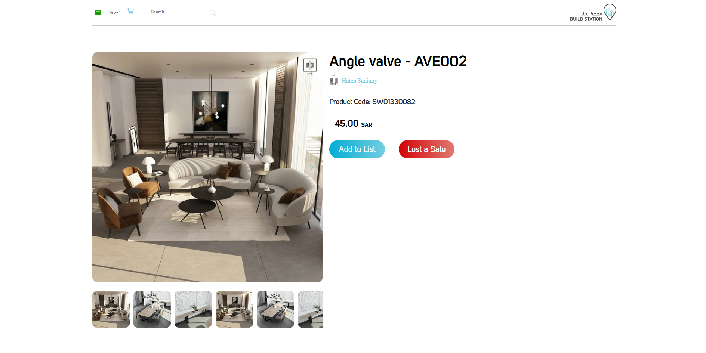
  

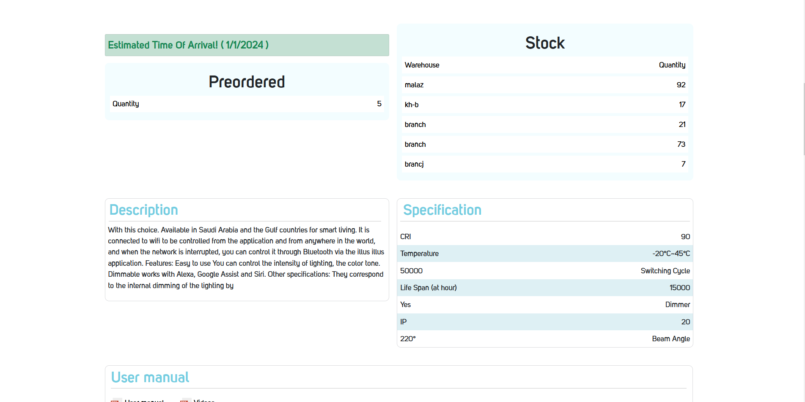
  

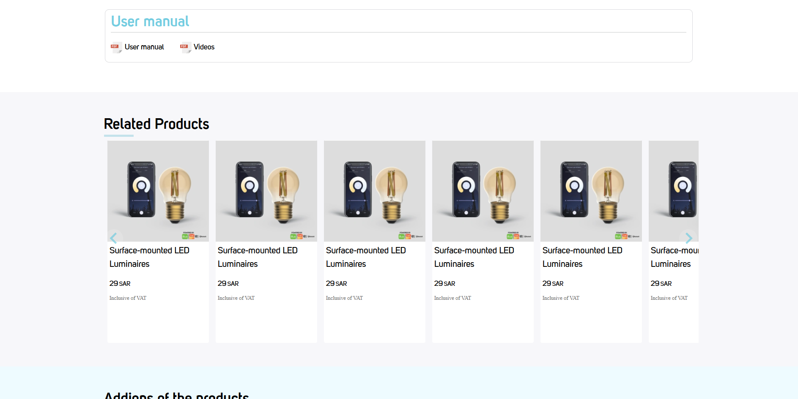
  

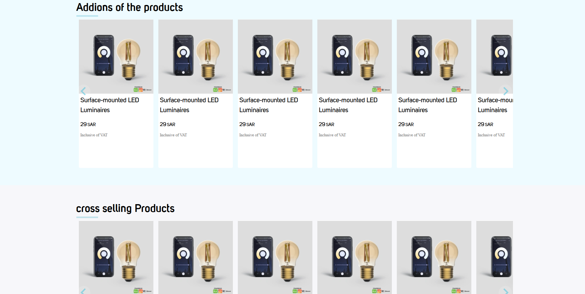
  

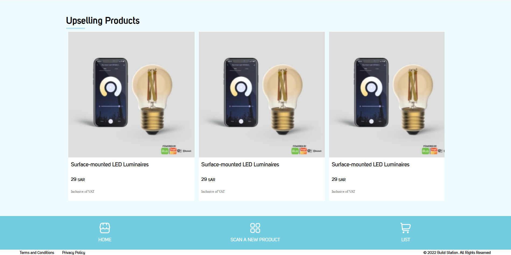
  

## Phone View

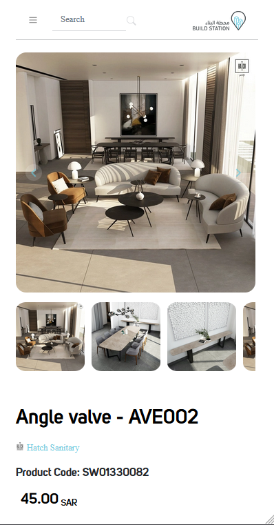
  

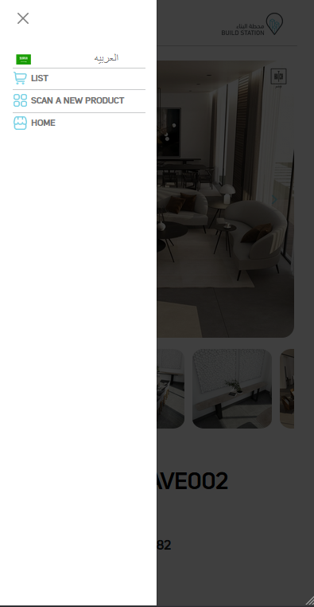
  

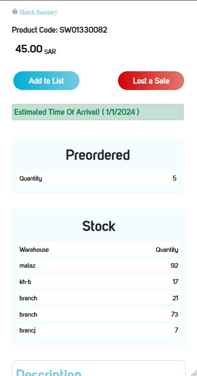
  

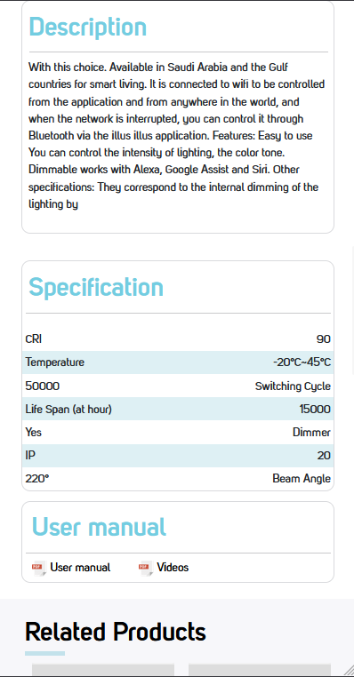
  

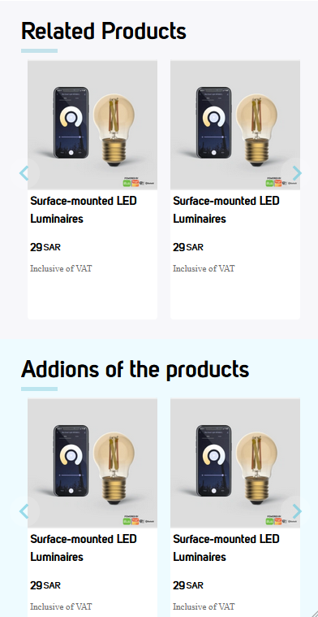
  

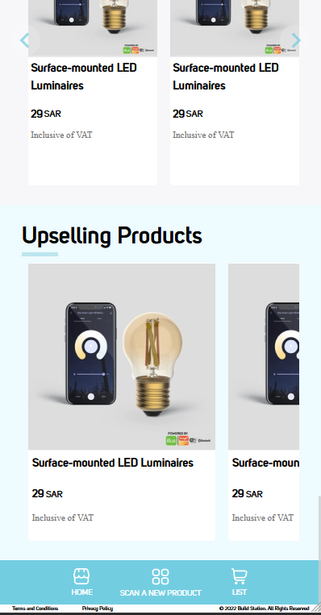
  
