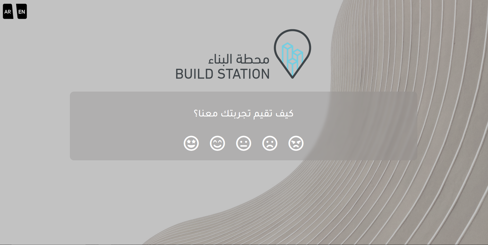
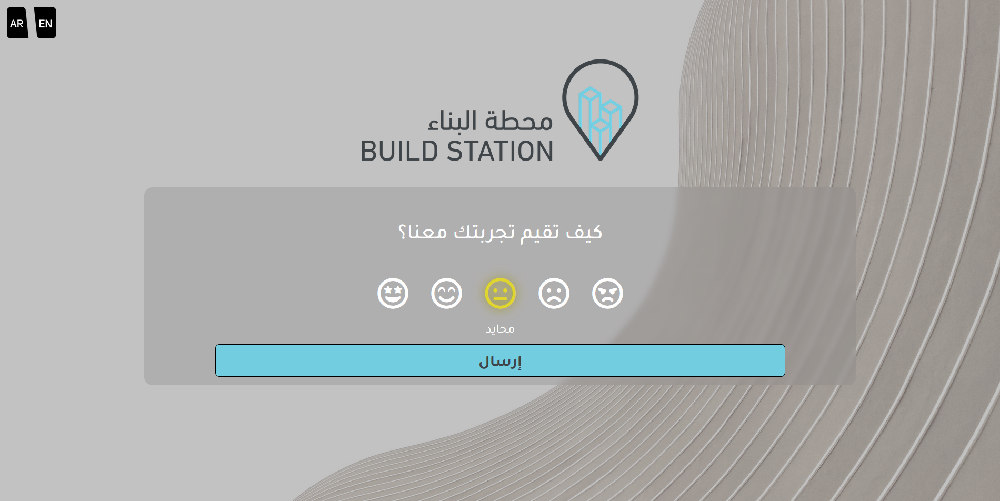
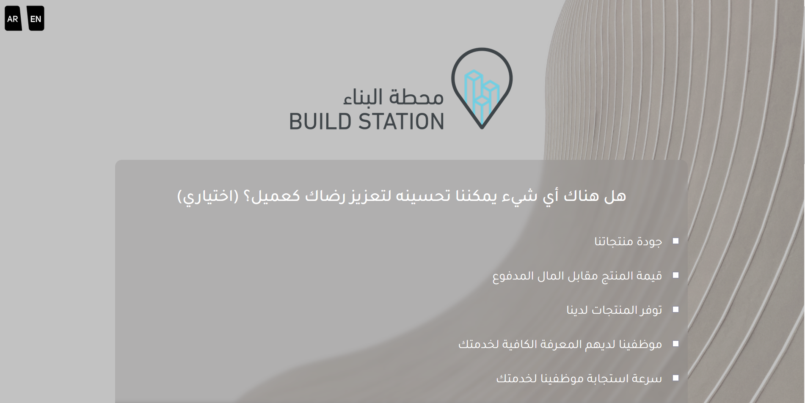
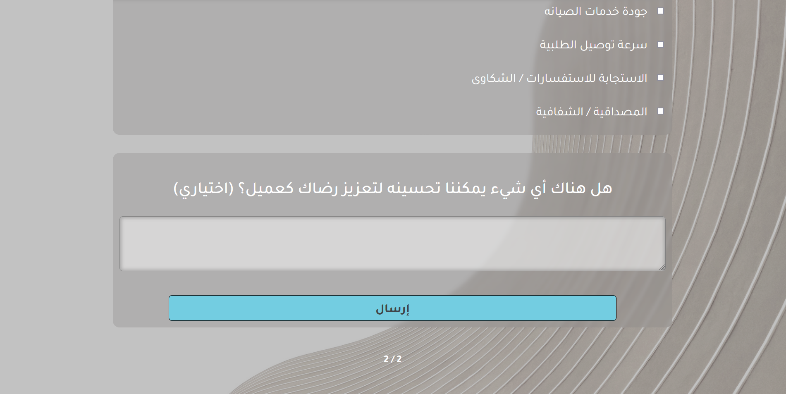
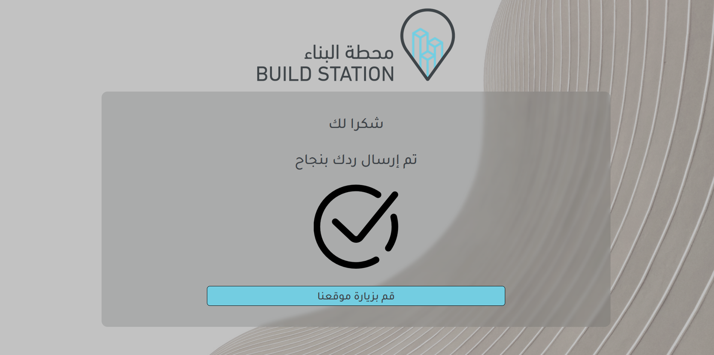

# Project Overview

This project is a survey application designed to provide users with a seamless experience while collecting feedback. Below are some samples of the survey view:

Survey View Features:

1. Fully Responsive: The survey view is designed to adapt to different screen sizes and devices.

2. Language Switching: Users can easily switch between English and Arabic without reloading the page. The language switcher is conveniently located in the top left corner.

3. Store Redirect: Clicking on the logo directs users to the store, enhancing navigation.

4. Interactive Rating Selection: Emojis are used for rating selection, with hover effects for intuitive interaction.

5. Dynamic Submit Button: The submit button appears when the user selects a rating emoji, promoting user engagement.

6. Progressive Question Display: Upon submitting a rating, the first question disappears, and subsequent questions are displayed, ensuring a smooth survey flow.

7. Page Counter: The footer of the page includes a page counter, providing users with context on their progress within the survey.

8. Redirect to Store: After completing the survey, users are redirected to another page with a button to further redirect them to the store, facilitating seamless navigation.

  

  

  

  

  

  
