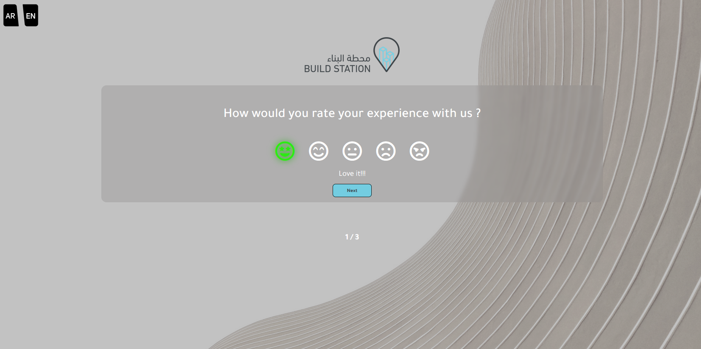
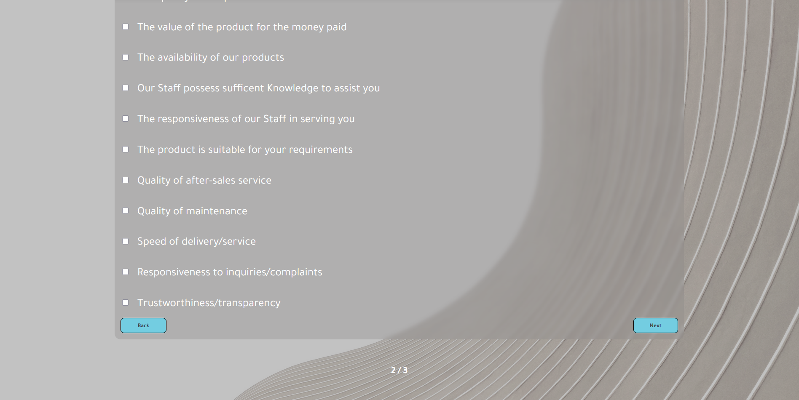
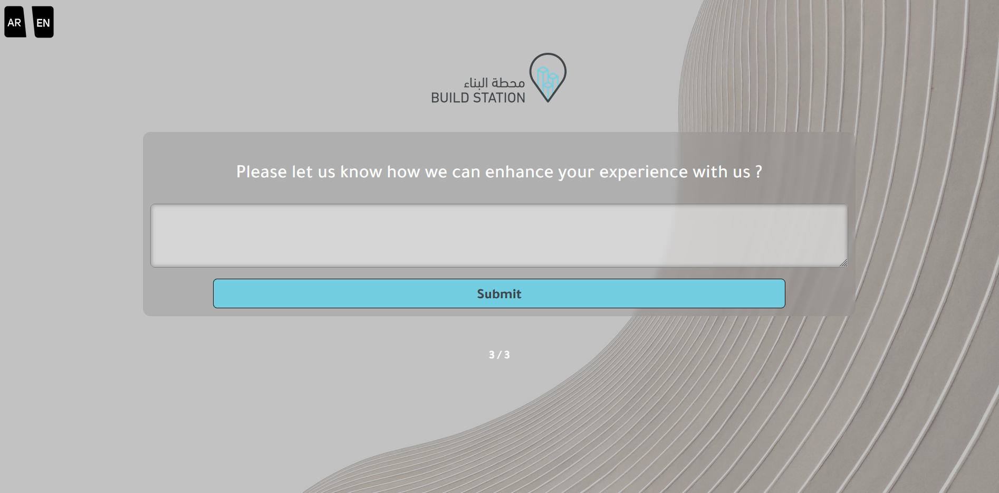
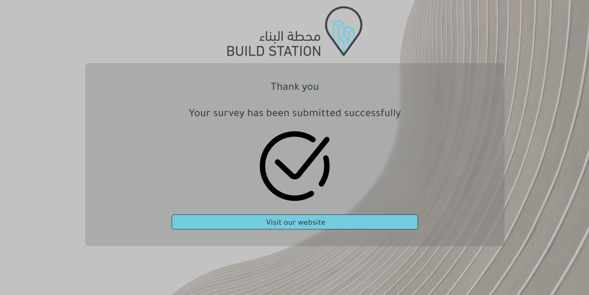

# Project Overview

This project is an alternate version of third sample, with slight modifications. It retains the responsive design and functionality of the original version but includes hidden navigation elements until interaction occurs.

Features:

1. Language Selection: Choose between Arabic and English languages by clicking on the icons in the top left corner.

2. Interactive Questions: Answer questions using emojis with distinct colors and hovering effects.

3. Navigation Buttons: Move to the next question with a button. The first question does not have a back button, but subsequent questions do.

4. Hidden Navigation: The next button and page counter on the first page are hidden until the user interacts with the emojis.

5. Footer Page Counter: Keep track of the current page number in the footer.

6. Thank You Page: Upon submission, users are redirected to a thank you page with a button to visit the website.

7. Store Redirection: Users have the option to visit the store by clicking on the logo displayed on the first page or by clicking a button on the submission confirmation page. This feature encourages users to explore our products further.

  

  

  

  
