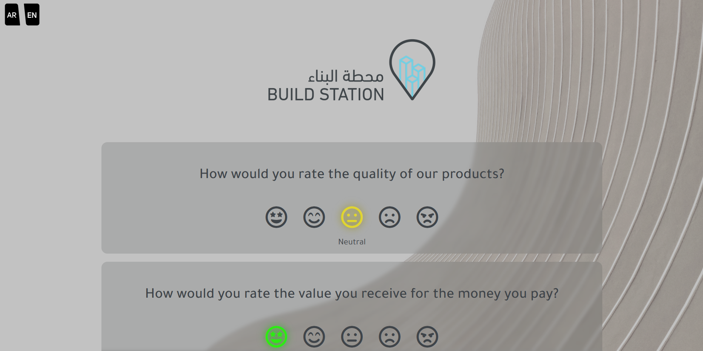
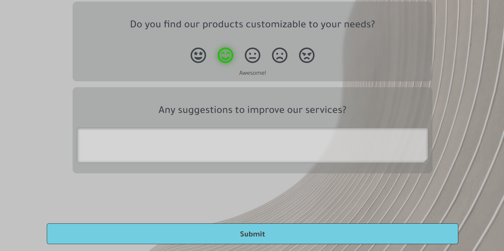
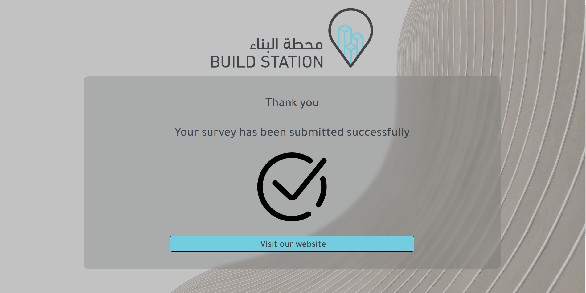

# Project Overview

This project aims to create an interactive survey form where users can provide feedback using emojis. The form includes several questions designed to gather valuable insights from participants.
Features:

1. Fully Responsive: The survey view is designed to adapt to different screen sizes and devices.

2. Emoji Rating System: Users can rate their responses to survey questions using emojis, each of which has a hover effect to enhance user experience.

3. Language Switch: The form includes buttons in the top left corner to toggle between English and Arabic languages. This feature ensures accessibility for users who prefer different languages.

4. Submission Button: After completing the survey, users can submit their answers by clicking the "Submit" button. Upon submission, users are redirected to a page thanking them for their participation.

5. Store Redirection: Users have the option to visit the store by clicking on the logo displayed on the first page or by clicking a button on the submission confirmation page. This feature encourages users to explore our products further.

  

  

  
