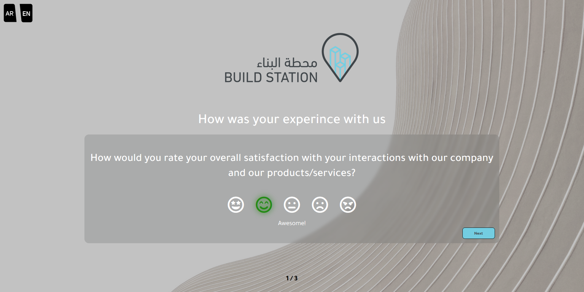
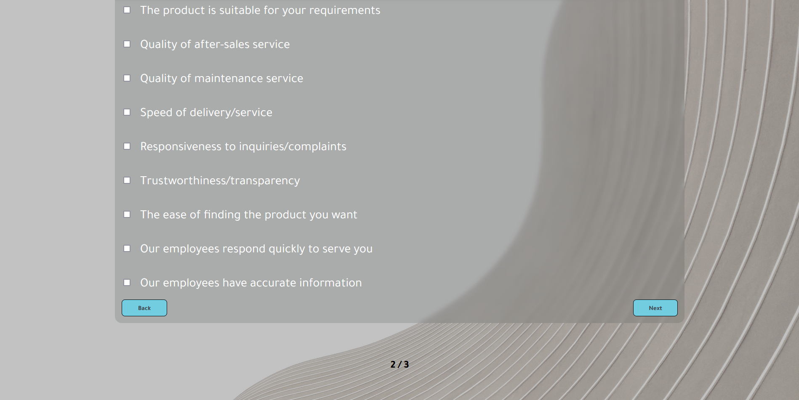
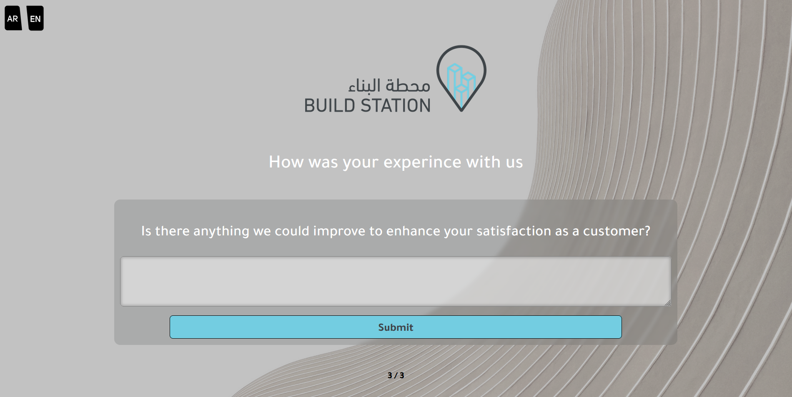
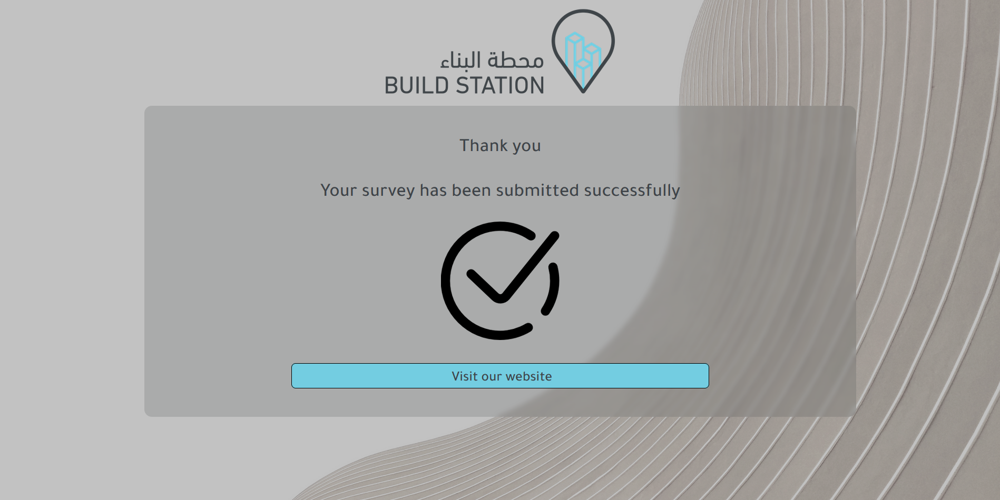

# Project Overview

This project is a responsive frontend page built using HTML, CSS, Bootstrap, and JavaScript. It includes language selection, interactive questions with emojis, navigation buttons, and a footer with a page counter.

Features:

1. Language Selection: Choose between Arabic and English languages by clicking on the icons in the top left corner.

2. Interactive Questions: Answer questions using emojis with distinct colors and hovering effects.

3. Navigation Buttons: Move to the next question with a button. The first question does not have a back button, but subsequent questions do.

4. Footer Page Counter: Keep track of the current page number in the footer.

5. Thank You Page: Upon submission, users are redirected to a thank you page with a button to visit the website.

6. Store Redirection: Users have the option to visit the store by clicking on the logo displayed on the first page or by clicking a button on the submission confirmation page. This feature encourages users to explore our products further.

  

  

  

  
